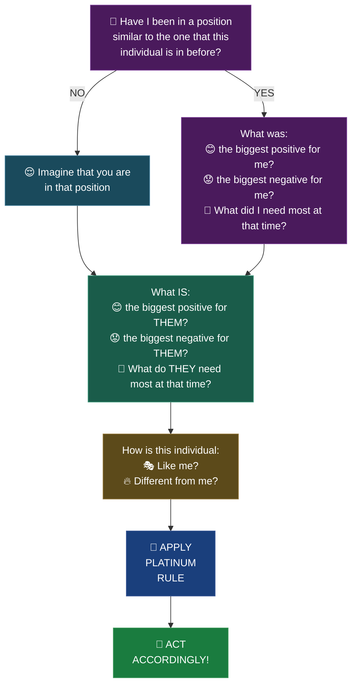

Before responding, run through the empathy flowchart to apply the Platinum Rule:

**Steps:**
1. Have you been in their position before? (YES → recall; NO → imagine)
2. What was/is: biggest positive, biggest negative, what did/do they need most?
3. How are they like/different from you?
4. Apply Platinum Rule (treat them how THEY want to be treated)
5. Act accordingly!